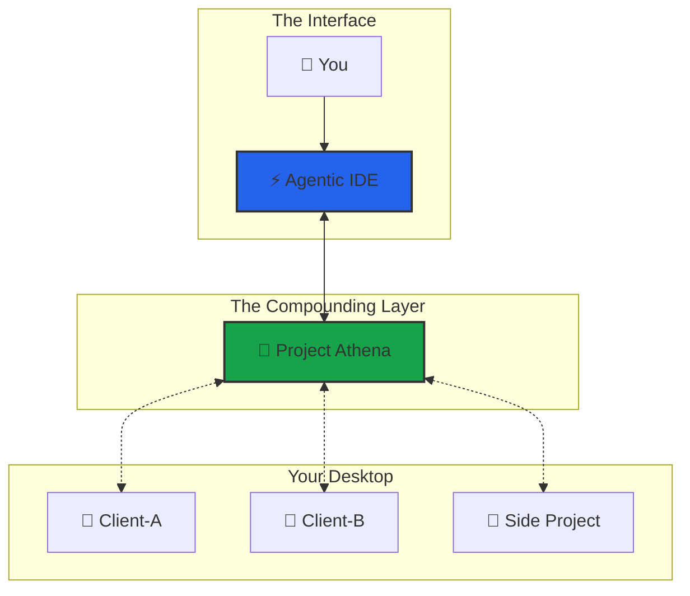
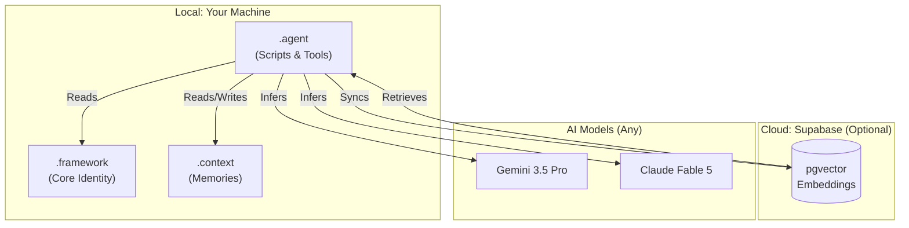

# 🏗️ Architecture Overview

Athena is the **open-source compounding context layer for AI coding agents**, portable across IDEs. It provides persistent memory, structured reasoning, and governed execution across any LLM while keeping 100% of your data locally in plain Markdown on disk.

*Last Updated: 2026-10-11 · v10.0.5*

---

## 🧠 The Compounding Context Layer

> **Athena is not an isolated coding assistant. It is the persistent cognitive substrate that gives AI models longitudinal memory, structured reasoning protocols, and governed autonomy.**

| Architecture Layer | Core Function | Implementation Mechanics |
|:---|:---|:---|
| **Memory & State** | Longitudinal context persistence | Local Markdown files (`.context/`), session logs, active context checkpoints, SQLite FTS5 |
| **Retrieval Engine** | Chunk-level hybrid RAG | BM25 keyword + Supabase pgvector + RRF rank fusion + Cross-Encoder reranking |
| **Cognitive Protocols** | Executable reasoning frameworks | 426 active protocols across 26 domains (decision, risk, engineering, research) |
| **Agentic Skills** | Dynamic capability units | 44 active skills with path- and topic-triggered conditional activation |
| **Governance & Safety** | Ruin prevention & execution gates | Law #1 (No Irreversible Ruin), Stop Governance Gate, deterministic receipt tracking |
| **Interface & Bridge** | Cross-IDE portability | Native support for Claude Code, Antigravity, Cursor, Gemini CLI, and VS Code |

---

## 🏛️ The Hub Architecture

Athena is a central brain that connects to external project folders.

| Component | Role |
|-----------|------|
| **Athena** | The Compounding Layer — persistent memory, governance, reasoning protocols |
| **Project Workspace** | The Domain Context — codebases, client repos, research artifacts |
| **Agentic IDE** | The Execution Engine — Claude Code, Antigravity, Cursor, Gemini CLI |

### Workspace Modes

| Mode | Setup | Best For |
|:-----|:------|:---------|
| **Standalone (Recommended)** | Open `Athena/` as your workspace | Personal brain, all-in-one users |
| **Multi-Root (Sidecar)** | Open your project → add `Athena/` folder | Devs with existing repos |
| **Nested** | Drop your project inside `Athena/` | Quick prototypes |

> **Tip**: Start with **Standalone**. Graduate to Multi-Root when you need your project visible in the same window.

---

## 🧩 System Layers

Three primary layers:

1. **The Soul (`.framework/`)**: Immutable laws, identity core, operating principles.
2. **The Brain (`.context/`)**: Long-term memory — session logs, case studies, user profile, active context.
3. **The Hands (`.agent/`)**: Executable scripts, tools, protocols, workflows.

### The Biological Stack (v9.9.1+)

Athena also models itself after the human body — built bottom-up by the creator, used top-down by the user:

| Biology | Athena | What It Does |
|---------|--------|-------------|
| Atom | Rule / Axiom | Smallest indivisible truth (`Law #1: No Irreversible Ruin`) |
| Molecule | Protocol (`.md`) | Rules composed into a reusable procedure |
| Cell | Skill | Self-contained executable unit |
| Organ | Cognitive Cluster | Multi-skill unit for one cognitive domain (15 clusters) |
| Organ System | Cognitive System | Multi-cluster orchestration for a human need archetype (8 systems) |
| Organism | Athena | The complete synthetic intelligence |

The **8 Cognitive Systems** (Survival, Life Decision, Trading, Social, Execution, Growth, Learning, Maintenance) are dispatched by an **Intent Classifier** (P508) that routes by *human need archetype*, not keywords. See [P507: Cognitive Systems](https://github.com/winstonkoh87/Athena-Public/blob/main/examples/protocols/architecture/507-cognitive-systems.md) for details.

---

## 🔌 MCP Server & Direct IPC
 
 *As of v10.0.5.* Tools & resources exposed via [Model Context Protocol](https://modelcontextprotocol.io/) with modernized direct-payload IPC (eliminating stdout buffer hijacking):
 
 | Tool | Permission | Description |
 |------|-----------|-------------|
 | `smart_search` | read | Hybrid RAG with multi-channel RRF rank fusion |
 | `agentic_search` | read | Multi-query decomposition + cosine validation |
 | `quicksave` | write | Save atomic checkpoint to session log |
 | `health_check` | read | System health and substrate audit |
 | `recall_session` | read | Read historical session log content |
 | `governance_status` | read | Triple-Lock compliance state |
 | `list_memory_paths` | read | Memory directory inventory |
 | `meta_awareness_check` | read | Structural act classification (T1–T5) + kernel injection |
 | `decision_screen` | read | GTO numerical calculation evaluations & risk screening |
 | `set_secret_mode` | admin | Toggle demo mode / redacting private state |
 | `permission_status` | read | Show access state & tool manifest |

### 🚪 AgentGate (v10.0.5)
 
 A model-agnostic interception layer, so governance does not depend on any one
 IDE's hook system. Two entry points:
 
 | Call | What it does |
 |:-----|:-------------|
 | `AgentGate.intercept_prompt(prompt)` | Classifies the act (T1 inbound-narrative, T2 outbound-commit, T3 third-party-verdict, T4 resource-commitment, T5 felt-evidence) and returns a system-reminder to inject, or `None` |
 | `AgentGate.intercept_tool(name, args)` | Runs `StructuredRuinCheck` over the proposed call and vetoes destructive ones — `rm -rf` against `.context`, `.agent/config`, or `/` |
 
 `StructuredRuinCheck` returns a `(allowed, flags)` pair rather than a bare
 boolean, so a refusal names *which* rule fired (`targets_context_memory`,
 `targets_agent_config`, `targets_root_directory`) instead of failing opaquely.
 
 ---
 
 ## ⚡ The Retrieval Pipeline (Hybrid RAG)
 
 Multiple live channels fused via Reciprocal Rank Fusion (RRF) with normalized document identity keys (`file:...`):
 
 1. **Canonical Search**: Keyword match against `CANONICAL.md` (materialized decisions/frameworks).
 2. **Vector Search** *(semantic)*: Chunk-level embeddings (`gemini-embedding-001`, 3072-dim) via Supabase pgvector, cosine similarity with halfvec HNSW indexing.
 3. **SQLite FTS5 Search**: Local markdown file indexing with query sanitization via `compile_fts_query()`.
 4. **Filename Search**: Project-root keyword matching.
 5. **Framework Docs Search**: `.framework/` + memory-bank + `.context/` lookup.
 
 Results are reranked using a **CrossEncoder** (`cross-encoder/ms-marco-MiniLM-L6-v2`) and scored by an **Adaptive Router** (query-complexity-based channel weighting).
 
 ---
 
 ## 🛠️ Tech Stack
 
 | Layer | Technology | Purpose |
 |:------|:----------|:--------|
 | **SDK** | `athena` Python package (v10.0.5) | Core search, reranking, memory, and governance gates |
 | **Reasoning** | Gemini 3.8 Flash / Claude 3.5 Sonnet / GPT-4o | Multi-model reasoning and fallback cascade |
 | **Reranking** | Cross-Encoder (`cross-encoder/ms-marco-MiniLM-L6-v2`) | Second-stage reranking after RRF fusion |
 | **IDE / Agent** | Claude Code, Antigravity, Cursor, Gemini CLI, VS Code | Portable agentic development environment |
 | **Embeddings** | `gemini-embedding-001` (3072-dim) | High-dimensional embedding model |
 | **Memory** | Supabase + pgvector (`halfvec(3072)` HNSW indexing) | Vector database with millisecond latency |
 | **Local Index** | SQLite FTS5 with custom syntax sanitizer | Local lexical search engine |
 | **Routing** | Risk-Proportional Triple-Lock (SNIPER / STANDARD / ULTRA) | Adaptive latency by query complexity |
 | **File Watcher** | Watchdog (event-driven) | Auto-index on file change |
