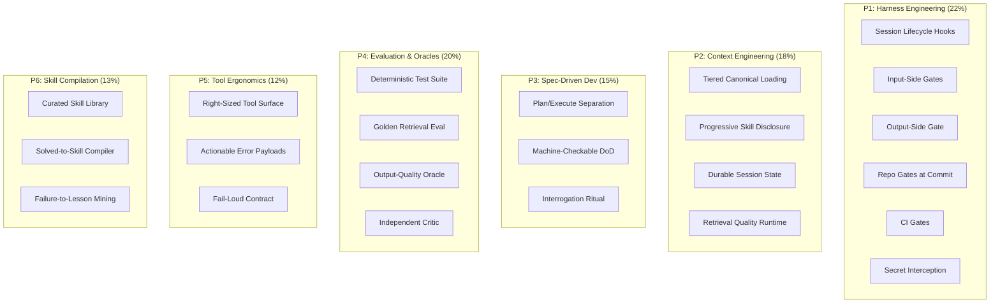

# Zero-Iteration Agent Harness Architecture

> **Last Updated**: 24 August 2026
> **TL;DR**: Human iteration is a symptom of missing mechanical verifiers. Build the harness so the agent gets it right the first time — or fails loudly before the human ever sees it.

---

## The Core Insight

Most AI agent failures share a common shape:

1. The agent produces output.
2. The human reviews it, finds errors.
3. The human corrects the agent.
4. Repeat until acceptable.

Each iteration burns the most expensive resource in the system: **human attention**. The Zero-Iteration Harness inverts this by requiring the agent to prove correctness *before* delivery, using deterministic mechanical verifiers rather than human review.

> **Principle**: If a human regularly catches the same class of error, that class should be caught by a machine gate — not by a smarter prompt.

---

## The 6-Pillar Architecture

Athena's harness is organized into six pillars, each independently scored on two axes:

- **Capability (C)**: Does the mechanism exist and function?
- **Enforcement (E)**: Is the mechanism wired into a gate that blocks bad output?

The effective score for any sub-variable is `C x E`. A capability that exists but has no enforcement gate scores zero — it's decoration, not protection.

```
Effective Score = Capability (C) x Enforcement (E)
```



---

## Pillar Breakdown

### P1: Harness Engineering & Deterministic Verification (22%)

The heaviest-weighted pillar. These are the mechanical gates that prevent bad output from reaching the human.

| Sub-Variable | What It Does |
|:---|:---|
| **Session lifecycle hooks** | `/start` boot sequence and `/end` teardown run automatically, ensuring context is loaded and insights are filed. |
| **Input-side gates** | Pre-tool-use interception blocks dangerous operations (secret leaks, ruin-class actions) before they execute. |
| **Output-side gate** | A `<300ms` verification hook runs on the Stop lifecycle event *before* turn delivery — catches LaTeX leaks, credential exposure, and syntax errors. |
| **Repo gates at commit** | Git hooks validate every commit (secret scanning, blocklist enforcement, version consistency). |
| **CI gates** | GitHub Actions enforce link integrity, privacy scans, CodeQL, and harness score thresholds. |
| **Loop / budget middleware** | Prevents runaway agent loops and enforces token budgets. |
| **Sandboxed execution** | Worktree isolation ensures parallel agents don't corrupt each other's state. |

### P2: Context Engineering & Memory (18%)

The agent's ability to load the right context at the right time.

| Sub-Variable | What It Does |
|:---|:---|
| **Tiered canonical loading** | Loads context in priority order: CANONICAL.md > glossary > META_PATTERNS > activeContext. |
| **Progressive skill disclosure** | Skills are loaded on-demand via context triggers, not pre-loaded into every session. |
| **Durable session state** | Session observations and active context persist across conversation boundaries. |
| **Retrieval quality runtime** | Semantic search (Exocortex) with reranking provides grounded answers from 1800+ sessions. |
| **Compaction discipline** | Context compactor prevents token overflow in long sessions. |

### P3: Spec-Driven Development (15%)

Forces the agent to understand the problem before writing code.

| Sub-Variable | What It Does |
|:---|:---|
| **Plan/execute separation** | The `/plan` workflow creates a design doc *before* any code is written. |
| **Machine-checkable DoD** | Definition of Done is expressed as executable assertions, not prose. |
| **Interrogation ritual** | The `spec-driven-dev` skill asks clarifying questions until requirements are unambiguous. |

### P4: Automated Evaluation, Oracles & Critique (20%)

The second-heaviest pillar. Catches regression before the human does.

| Sub-Variable | What It Does |
|:---|:---|
| **Deterministic test suite** | `pytest` suite validates all agent scripts and tools. |
| **Golden retrieval eval** | 41-query benchmark with baseline comparison detects retrieval quality drift. |
| **Output-quality oracle** | Automated scoring of deliverable quality against spec. |
| **Independent critic** | Fresh-context sub-agent reviews output without anchoring bias. |
| **Behavioural golden set** | Known-answer test cases verify the agent's reasoning hasn't regressed. |

### P5: Tool & API Ergonomics (12%)

Makes the agent's tools fail loudly and usefully.

| Sub-Variable | What It Does |
|:---|:---|
| **Right-sized tool surface** | Searchable, indexed tool catalog avoids overwhelming the agent's context. |
| **Actionable error payloads** | Tool failures return enough context for the agent to self-correct. |
| **Fail-loud contract** | Tools exit non-zero on failure rather than returning ambiguous success. |

### P6: Skill Compilation & Compounded Learning (13%)

Ensures the system gets smarter over time.

| Sub-Variable | What It Does |
|:---|:---|
| **Curated skill library** | 40+ skills indexed with context triggers for on-demand activation. |
| **Solved-to-skill compiler** | Novel task completions are automatically distilled into reusable skills. |
| **Failure-to-lesson mining** | Session traces are mined for reflexion entries that prevent repeat failures. |
| **Anti-bloat hygiene** | 1-in-1-out Rule of Retirement prevents unbounded protocol growth. |

---

## The Harness Score

The harness score is computed by `harness_score.py`, which **probes actual repo state** rather than trusting declared claims:

```
Total Score = Sum over all pillars: (pillar_weight * Sum(sub_weight * C * E))
```

Each sub-variable is probed live:
- Does the config file exist?
- Is the hook installed and executable?
- Does the CI workflow contain the expected step?
- Is the test suite passing?

This makes the score a **live diagnostic**, not a self-assessment.

### Running the Score

```bash
# Full probe with summary table
python3 .agent/scripts/harness_score.py

# Machine-readable JSON output
python3 .agent/scripts/harness_score.py --json

# CI gate mode (exit 1 if score < threshold)
python3 .agent/scripts/harness_score.py --check
```

---

## Design Principles

### 1. Prose Is Not a Mechanism

If a protocol says "the system continuously monitors X" but no code enforces it, it's a heuristic the agent must apply manually — not a running process. The harness score catches this: a sub-variable with high Capability but zero Enforcement scores zero.

### 2. Red Run or It Didn't Happen

Any change that claims to fix a gate must include:
1. The guard **failing** on the pre-fix state
2. The guard **passing** on the fixed state

If you can't make it go red, you haven't found the guard's edge — you've found its blind spot.

### 3. A Skip Is Not a Pass

Converting an assertion to `pytest.skip()` removes the guard. Skip on an explicit, named condition and assert on the other branch.

### 4. Mutation Over Assertion Count

Break the thing the guard protects and watch it fail. A test that survives the mutation is decoration.

---

## Related Documentation

- [Scheduled Tasks & Autonomous Self-RSI](SCHEDULED_TASKS.md)
- [User-Driven RSI Architecture](USER_DRIVEN_RSI.md)
- [System Principles & Anti-Patterns](BEST_PRACTICES.md)
